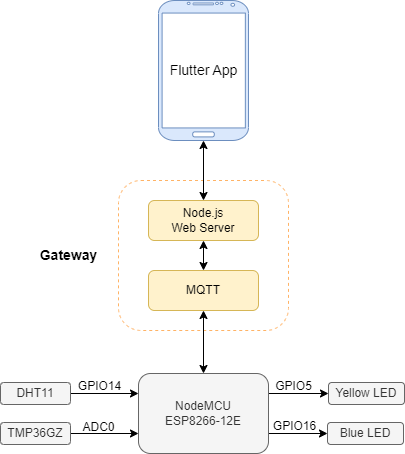
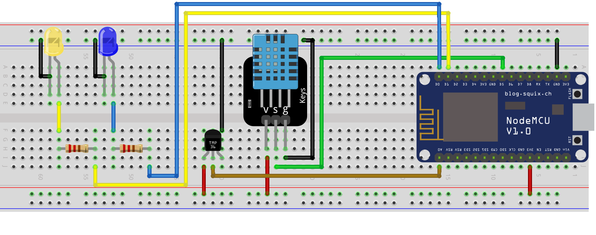

# Smart Sauna IoT Project
## Description
Smart Sauna is a demo project that aims to showcase the IoT technology. 
It consists of sensors, NodeMCU ESP8266-12E microcontroller, Gateway (MQTT broker + Web server) and Flutter mobile app. 
The user can monitor the temperature and humidity in the sauna, as well as the temperature of the water in the pool. 
It is also possible to set the target temperature and hysteresis for the heaters.

### Project diagram


## Hardware
### Sketch
You need to configure your Wi-Fi setup in `NodeMCU/smart_sauna.ino` file  
Configurable variables:
* `ssid` - Wi-Fi network name
* `password` - Wi-Fi password
* `mqtt_server` - ip address where the MQTT broker is running (e.g. "test.mosquitto.org" or local ip address of your pc if *gateway/docker-compose.yml* was run locally)

### Hardware design


### Component list
To recreate this project you need the following components:
* `NodeMCU ESP8266-12E` - microcontroller
* `TMP36GZ` - temperature sensor. Measures temperature in the "pool". Сan be replaced with some waterproof. 
* `DHT11` (3 pins) - temperature and humidity sensor. Measures temperature and humidity in the "sauna".
* `220 Ohm resistor` x2
* `LED` x2 - yellow LED is a "heater" in the "sauna" and the blue one is a "boiler" in the "pool". Can be replaced by relays connected to real heaters.
* `Some wires`
* `Breadboard` (optional)

## Gateway
Consists of a Node.js web server and a MQTT broker through which communication with the device takes place.  
To launch, you simply need to run from */gateway* folder:
```console
docker-compose up
```
If you want to use an external broker, pass its address to the server env variable `MQTT_SERVER` (e.g. *mqtt://test.mosquitto.org:1883*)  
### Web API
* **GET** `/getconfig` - get current device configuration
* **POST** `/setconfig` - set new configuration
* **GET** `/monitoring` - monitor indicators of temperature and humidity via SSE

## Flutter APP
